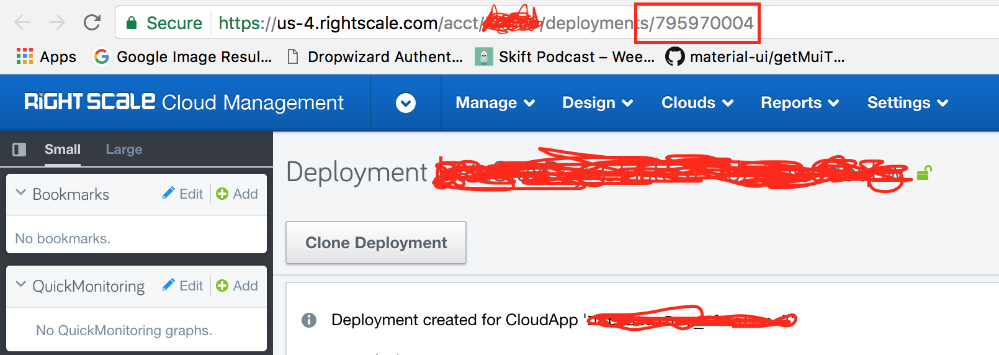

#1. Install Dependencies

```
pip install google-api-python-client oauth2client apiclient requests
```

#2. Download and set your google client secret

- Follow the instructions at https://cloud.google.com/genomics/downloading-credentials-for-api-access
- Place the resulting client_secrets.json file in this project folder

#3. Set configuration values

- sender_email: Set this to the sender's email address
- deployment_id: The deployment id of your RightScale deployment



- rightscale_refresh_token: Your RightScale API refresh token
    1. Navigate to Settings > API Credentials
    2. Enable the personal token
    3. Copy the resulting refresh token

- ssh_key: The SSH Key you wish to send as an attachment

#4. Set recipient emails

- Enter a newline separated list of emails into emails.txt

#5. Execute the script

```
python rightscaleEmail.py
```